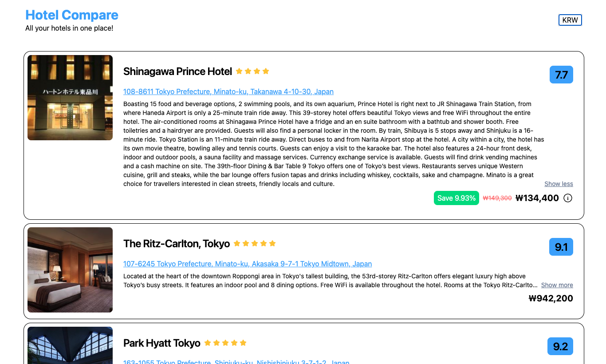

# Hotel Currencies & Price Competitiveness task
Hotel Compare is a simplified app that compares prices for booking hotels between various booking sites, in your currency of choice.
The aim is to be as transparent as possible, with taxes and fees being shown where applicable. This isn't always possible as some only add the taxes and fees after booking, resulting in a discrepency of hotel rates.

## Preview

## How to start
- either use `bun` or `yarn`, depending on choice of package manager
- if using `bun` and not installed, install it first:
  - curl https://bun.sh/install | bash
  - `bun install`
  - `bun dev`
- if using `yarn`
  - `yarn install`
  - `yarn dev`
- open `http://localhost:5173/` or `http://localhost:3000` (if you've used --port 3000) to use the app

## Design & choice of technology
- Storing/persistence of Currency
  - Options here are to either put it in the URL (which makes sense for customers who come in via google search results)
  - Or to put it in a datastore with persistent storage in the browser like localstorage 
  - In this case I chose to go with the latter, using Zustand with persist middleware
- Routing:
  - With this being a small feature, I've opted to keep routing out of it, so it will be just a single page with dynamic changing parts.
- Design library
  - Tailwindcss + WindUI for copy & paste components, since choice of UI is freely given rather than having to implement from a figma or specific design
- Design inspiration
  - Eventually took the design from booking.com, seems clean and straghtforward

## Testing
- Tests are written using jest for unit and integration tests
- Cypress can be used for e2e, but would not be meaningful in this case as there are no "golden user paths"

## Security
- Usually to save across browsers some kind of backend would be needed with a database to store user details so we can figure out
what currency the user is using across different platform (web or mobile web)
- In this case opted against using any kind of backend since that delves into further complicating the app

## Logging & Monitoring
- Sentry would be a good choice for logging, since it allows viewing of sessions and has webhooks for alerting when an error/errorneous behaviour
is detected.

## Points of struggle
- Not exactly the best at determining what UI would look nice, so took awhile to settle on something

## Features list
- Currency Switching
  - [x] Store/switch preferred currency, default to USD
  - [x] Round Currencies appropriately
- Competitor Pricing
  - [x] Do not show competitors or savings if no competitors
  - [x] Do not show savings if competitors are all cheaper
  - [x] Show savings over most expensive competitor's rates where applicable
  - [x] Show relative positioning to competitors
- Taxes & Fees
  - [x] Highlight taxes & fees if included
  - [x] Show asterisk with breakdown in popover